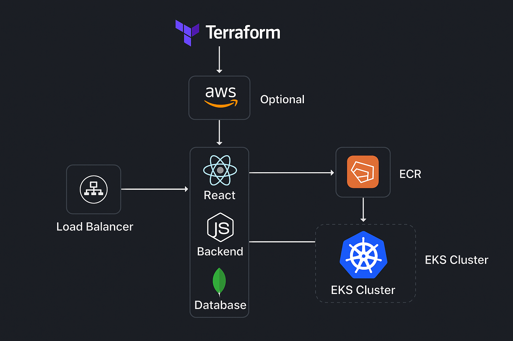

# 🚀 Three-Tier Web App on AWS EKS (React + Node + MongoDB)


A hands-on deployment of a **three-tier web application** — **ReactJS** (frontend), **NodeJS/Express** (backend), and **MongoDB** (database) — containerized with **Docker**, stored in **Amazon ECR**, and deployed to **Amazon EKS** using **Kubernetes manifests**.  
Built as part of **#TWS Three-Tier App Challenge** to learn cloud-native deployments.

---

## 📑 Table of Contents
- [Architecture](#-architecture)
- [Tech Stack](#-tech-stack)
- [Repository Structure](#-repository-structure)
- [Prerequisites](#-prerequisites)
- [Quick Start](#-quick-start)
- [Screenshots](#-screenshots)
- [What I Learned](#-what-i-learned)
- [Cleanup](#-cleanup)
- [Roadmap / Future Enhancements](#-roadmap--future-enhancements)
- [License](#-license)

---

## 🏗 Architecture

## 🏗️ Architecture

Below is the architecture of the deployed Three-Tier Web Application on AWS.



---

## 🖼 Screenshots

**Amazon ECR (Private Repositories)**  
<br>


**Deployed To-Do App (Frontend on AWS EKS)**  
<br>


---

User → ALB → EKS
Frontend (React) → Backend (Node/Express) → MongoDB (Stateful)
Docker images stored in Amazon ECR

---

## 🧰 Tech Stack

| Layer | Tools |
|------|------|
| Frontend | ReactJS |
| Backend | NodeJS, Express |
| Database | MongoDB |
| Containers | Docker |
| Registry | Amazon ECR (private repos) |
| Orchestration | Kubernetes on Amazon EKS |
| IaC | Terraform (infra provisioning) |
| Networking | AWS Load Balancer Controller, Services/Ingress |

---

## 📁 Repository Structure

├── Application-Code/
│ ├── frontend/ # React app
│ └── backend/ # Node/Express API
├── Kubernetes-Manifests-Files/
│ ├── namespace.yaml
│ ├── frontend-deployment.yaml
│ ├── backend-deployment.yaml
│ ├── mongo-statefulset.yaml
│ ├── services.yaml
│ └── ingress.yaml # if using ALB ingress
└── Jenkins-Server-TF/ # (optional IaC samples; Jenkins not used in this run)


> If your file names differ, keep the structure section aligned with your repo.

---

## ✅ Prerequisites

- AWS account with permissions for **EKS, ECR, IAM, EC2, VPC**.
- Local/EC2 control node with:
  - AWS CLI v2, Docker, `kubectl`, `eksctl`, Terraform
- Basic knowledge of Docker & Kubernetes.

---

## ⚡ Quick Start


### 1) Configure AWS & Tools
```bash
aws configure
# verify versions
aws --version
docker --version
kubectl version --client --short
eksctl version
terraform -v
```
### 2) Create/Connect EKS Cluster (example: us-east-1)
```bash
eksctl create cluster \
  --name three-tier-cluster \
  --region us-east-1 \
  --node-type t2.medium \
  --nodes-min 2 --nodes-max 2

aws eks update-kubeconfig --region us-east-1 --name three-tier-cluster
kubectl get nodes

```
### 3)Build & Push Images to ECR
```bash
# Login
aws ecr get-login-password --region us-east-1 \
| docker login --username AWS --password-stdin <ACCOUNT_ID>.dkr.ecr.us-east-1.amazonaws.com

# Build & tag
docker build -t three-tier-frontend ./Application-Code/frontend
docker build -t three-tier-backend  ./Application-Code/backend

docker tag three-tier-frontend:latest <ACCOUNT_ID>.dkr.ecr.us-east-1.amazonaws.com/three-tier-frontend:latest
docker tag three-tier-backend:latest  <ACCOUNT_ID>.dkr.ecr.us-east-1.amazonaws.com/three-tier-backend:latest

# Push
docker push <ACCOUNT_ID>.dkr.ecr.us-east-1.amazonaws.com/three-tier-frontend:latest
docker push <ACCOUNT_ID>.dkr.ecr.us-east-1.amazonaws.com/three-tier-backend:latest
```
### 4) (One-time) AWS Load Balancer Controller
```bash
# OIDC provider & IAM policy/service account as per AWS docs
eksctl utils associate-iam-oidc-provider --cluster three-tier-cluster --approve --region us-east-1
# ...create policy and service account...
```
### 5) Deploy Kubernetes Manifests
```bash
kubectl apply -f Kubernetes-Manifests-Files/
kubectl get pods,svc -n workshop
```
### 6) Access the App

- Wait for the **LoadBalancer** external address to be created.
- Open the provided external URL in a browser to access the **React frontend**.
---
### 🖼 Screenshots

Amazon ECR (private repos)
<br>


Deployed App (To-Do List UI)
<br>

---
🧠 What I Learned

Containerizing frontend & backend and pushing to Amazon ECR.

Creating and operating an EKS cluster with eksctl.

Writing & applying Kubernetes manifests (Deployments, Services, StatefulSet).

Exposing services via AWS Load Balancer Controller.

Practical understanding of three-tier architecture on AWS.
---
### 🧹 Cleanup
```bash
eksctl delete cluster --name three-tier-cluster --region us-east-1

```
Then delete EC2 instances, ECR images/repos, and load balancers to avoid charges.
---
### 🗺 Roadmap / Future Enhancements

CI/CD with GitHub Actions or Jenkins (build, scan, push, deploy).

Helm charts for parameterized deployments.

Prometheus & Grafana for metrics/visualization.

ArgoCD for GitOps.

Horizontal/Vertical Pod Autoscaling, PodDisruptionBudgets, readiness/liveness probes.


